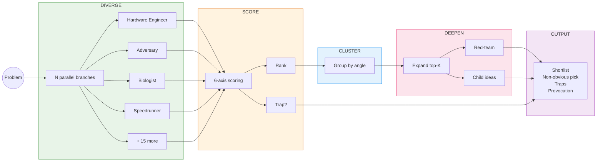

<p align="center">
  
</p>

# ADHD Flow

**Tree-of-thought brainstorming engine built on the [Claude Agent SDK](https://github.com/anthropics/claude-agent-sdk-typescript).**

Stop your agent from picking the first answer. ADHD Flow fans out parallel divergent ideas under different cognitive frames, scores them on six axes, flags traps, clusters the idea space, and deepens the survivors with red-team critique.

Structured ADHD: let the ideas scatter first, then focus.

[](LICENSE)

---

## Why

Most LLM workflows converge too early. You ask a question, you get one answer, you ship it. That answer is almost always the obvious one — the first thing the model would say.

ADHD Flow forces divergence *before* convergence:

- **Multiple cognitive frames** look at the same problem simultaneously, in isolation
- **No cross-talk during generation** — branches don't see each other, so ideas stay diverse
- **A critic phase scores everything** after divergence is complete — not during
- **Trap detection** catches ideas that look good but hide fatal flaws
- **Red-team critique** stress-tests the survivors before you commit

The result: you see the shape of the idea space, not just one point in it.

---

## How It Works



Each phase maps to a single file in `src/core/`. The engine orchestrates them with controlled concurrency via [`p-limit`](https://github.com/sindresorhus/p-limit). No branch sees another during divergence — cross-pollination only happens in the deepen phase.

---

## Quick Start

```bash
git clone https://github.com/StuckInTheNet/ADHD_Flow.git
cd ADHD_Flow
npm install

# Requires ANTHROPIC_API_KEY in your environment
export ANTHROPIC_API_KEY="sk-ant-..."

npm run dev -- "design a rate limiter that survives a leader election"
```

You'll see progress on stderr as frames fire, and the final report on stdout.

---

## Usage

```bash
# Basic brainstorm
adhd-flow "how should we shard this queue?"

# More divergence, structured output
adhd-flow "optimize this endpoint" --frames 8 --output json

# Feed it code context
adhd-flow "refactor this module" --context ./snippet.ts --top 5

# Non-engineering problems
adhd-flow "name this product" --no-code-mode --frames 6

# Custom scoring criteria
adhd-flow "..." --scoring-prompt ./my-scoring.txt

# Pipe to file
adhd-flow "..." --quiet --output json > result.json
```

### Global Install

```bash
npm run build
npm link
adhd-flow "your problem here"
```

---

## Flags

| Flag | Description | Default |
|------|-------------|---------|
| `--frames N` | Parallel divergence branches | `5` |
| `--ideas N` | Ideas generated per branch | `6` |
| `--top N` | How many ideas to deepen | `3` |
| `--concurrency N` | Max parallel LLM calls | `4` |
| `--context PATH` | Inject a file as context (code, constraints, docs) | - |
| `--model NAME` | Override the Claude model | - |
| `--no-code-mode` | Remove engineering bias from frame selection | - |
| `--output FORMAT` | `markdown` `json` `yaml` `dot` `html` | `markdown` |
| `--scoring-prompt PATH` | Custom system prompt for the scoring phase | - |
| `--red-team-prompt PATH` | Custom system prompt for red-team critique | - |
| `--quiet` | Suppress progress output on stderr | - |

---

## Output Formats

| Format | Use case |
|--------|----------|
| `markdown` | Human-readable report (default) |
| `json` | Programmatic consumption, piping to other tools |
| `yaml` | Same structure as JSON, easier to scan |
| `dot` | Graphviz graph of the idea space — render with `dot -Tpng` |
| `html` | Self-contained HTML report, shareable without tooling |

---

## Cognitive Frames

Each run selects N frames from a built-in registry of 19 perspectives. In code mode (default), selection is biased toward engineering-relevant frames. At least one "wild" frame is always included to keep divergence unpredictable.

| Frame | Angle | Tags |
|-------|-------|------|
| Hardware engineer | Latency, memory layout, physical constraints | `code` `wild` |
| Regulator / auditor | Compliance, traceability, failure modes | `design` `general` |
| 10-year-old | Naive, unencumbered, convention-free | `general` `wild` |
| Competitor / adversary | Exploit and sabotage the obvious solution | `code` `design` |
| Biology | Immune systems, neural plasticity, evolution | `code` `wild` |
| Logistics / supply chain | Queues, batching, hub-and-spoke, last-mile | `code` `design` |
| Game design | Loops, rewards, friction, speedrun tricks | `design` `general` |
| Markets | Auctions, futures, clearing houses | `design` `wild` |
| Inversion | Guarantee NOT-X, then negate back | `code` `design` `general` |
| $0 budget, 1 hour | Crudest version that does the load-bearing thing | `code` `general` |
| Infinite budget, 10 years | Maximalist version at unlimited scale | `design` `wild` |
| Remove the assumption | Delete the thing everyone treats as fixed | `code` `design` `wild` |
| Speedrunner | Glitches, skips, abusive-but-legal shortcuts | `code` `wild` |
| Ant colony / swarm | Emergent, decentralized, local rules only | `code` `wild` |
| On-call at 3am | Design that prevents the page | `code` `design` |
| Historian | Old / forgotten technologies, precedents | `design` `general` |
| Artist / poet | Aesthetic, elegant, regardless of practicality | `design` `wild` |
| Child psychologist | So simple a child could use it | `design` `general` |
| Data scientist | What does the data tell us we're missing? | `code` `design` |

You can register custom frames programmatically via `FrameRegistry.registerFrame()`.

---

## Integrations

Push a specific idea from your run directly to an external service:

**GitHub Issues**
```bash
adhd-flow "..." --create-issue-from-idea IDEA_ID \
  --github-owner OWNER --github-repo REPO --github-token TOKEN
```

**Linear**
```bash
adhd-flow "..." --create-linear-issue-from-idea IDEA_ID \
  --linear-team-id TEAM_ID --linear-token TOKEN
```

**Notion**
```bash
adhd-flow "..." --create-notion-page-from-idea IDEA_ID \
  --notion-database-id DB_ID --notion-token TOKEN
```

**Google Docs**
```bash
adhd-flow "..." --create-google-doc-from-idea IDEA_ID \
  --google-docs-access-token TOKEN
```

**Slack**
```bash
adhd-flow "..." --post-to-slack-from-idea IDEA_ID \
  --slack-channel CHANNEL --slack-token TOKEN
```

Idea IDs are UUIDs printed in the JSON/YAML output. Use `--output json` to see them.

---

## Architecture

```
src/
  cli.ts                    CLI entry point, arg parsing + validation
  core/
    engine.ts               Orchestrator: diverge -> score -> cluster -> deepen
    divergence.ts            Fan-out: one LLM call per frame, pure generation
    scoring.ts               Critic: 6-axis scoring + trap detection
    clustering.ts            Group ideas by underlying angle
    deepening.ts             Recursive expansion of top-K ideas
    red-teaming.ts           Adversarial critique of deepened ideas
    frames.ts                Frame registry (19 cognitive perspectives)
    llm.ts                   Thin wrapper around Claude Agent SDK query()
    render.ts                Markdown, JSON, YAML, Graphviz renderers
    html-renderer.ts         Self-contained HTML report renderer
    types.ts                 TypeScript type definitions
    integrations/            GitHub, Linear, Notion, Google Docs, Slack
  ui/                        React + Vite interactive frontend
tests/
  core/                      Vitest unit tests (one per module)
```

### Key Design Decisions

- **LLM calls are stateless one-shots.** Each `callLLM()` creates a fresh session. No tool use during divergence — tools create convergence pressure.
- **Branches are isolated.** During the diverge phase, no branch sees another branch's output. Cross-pollination only happens in the deepen phase.
- **Errors don't crash the run.** A failed branch returns empty results with a stderr warning. The remaining branches still produce output.
- **Scoring is weighted.** Default weights: novelty 0.2, viability 0.3, fit 0.2, impact 0.2, effort -0.1, risk -0.1. Override with `ScoringWeights` programmatically.

---

## Development

```bash
npm run dev          # Run CLI via tsx (no build step)
npm run build        # Compile TypeScript to dist/
npm start            # Run compiled CLI
npm test             # Run Vitest (48 tests)
```

### Stack

- TypeScript 5 + Node ESM
- [Claude Agent SDK](https://github.com/anthropics/claude-agent-sdk-typescript) for LLM calls
- [p-limit](https://github.com/sindresorhus/p-limit) for concurrency control
- [Vitest](https://vitest.dev) for testing
- React + Vite for the UI (separate app in `src/ui/`)

---

## License

[MIT](LICENSE)
